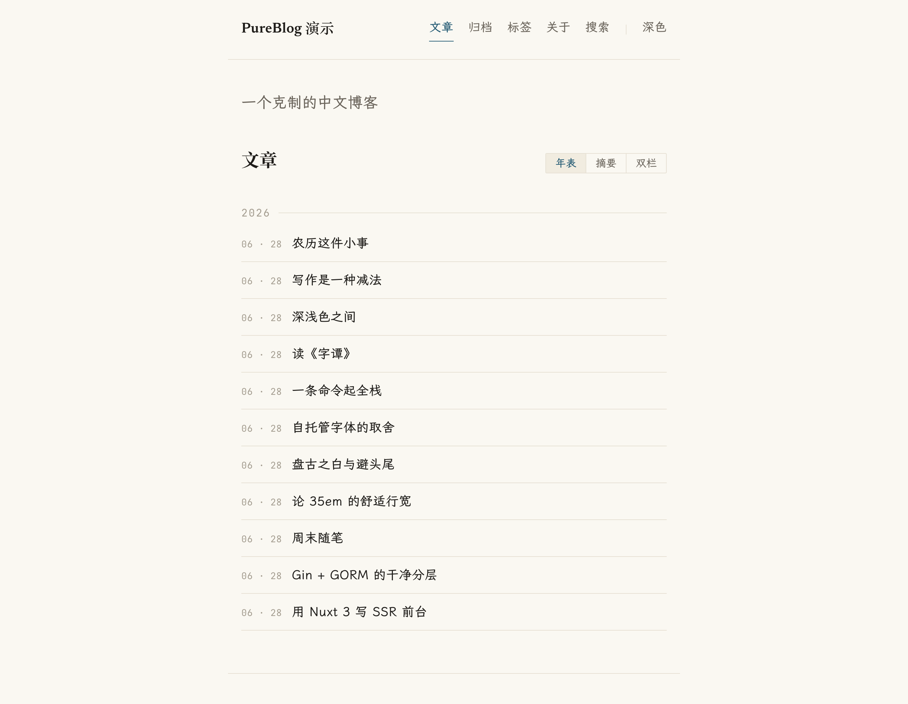
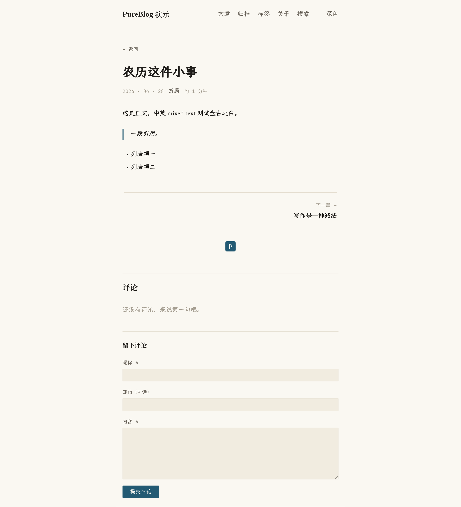
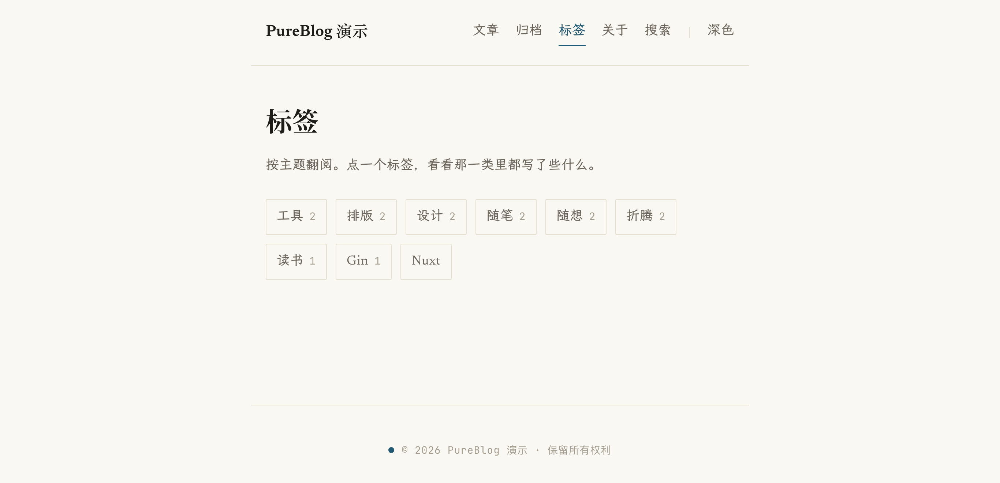

<div align="center">

# PureBlog v3

一个克制的中文博客系统。正文霞鹜文楷,标题宋体,35em 行宽,唯一的强调色是黛青 `#235A73`。

[](https://github.com/muxik/PureBlog/actions/workflows/ci.yml)
[](https://go.dev)
[](https://vuejs.org)
[](https://nuxt.com)
[](https://www.postgresql.org)
[](./LICENSE)

</div>

---

## 简介

PureBlog 是一个给中文写作用的个人博客系统。正文用 [霞鹜文楷](https://github.com/lxgw/LxgwWenKai)、标题用宋体,行宽控制在 35em,中英文之间留「盘古之白」,不用卡片、阴影和渐变。

v3 是从头重写的一版。v2 基于 PHP / ThinkPHP / MySQL,v3 只保留了项目名和产品形态,代码与数据都没有沿用。

## 截图

| 首页(年表布局) | 文章页 |
|:---:|:---:|
| [](docs/screenshots/home.png) | [](docs/screenshots/article.png) |

首页可在年表 / 摘要 / 双栏三种布局间切换,支持深浅色与公历↔农历。

<p align="center">
  <a href="docs/screenshots/tags.png"></a>
</p>

## 设计 · 黛 Dài

| | |
|---|---|
| 底色 | 暖纸 `#FAF8F2`,墨色三级 |
| 强调色 | 仅一种,黛青 `#235A73`(深色模式提亮为 `#79B0C9`) |
| 字体 | 正文 霞鹜文楷,标题 Noto Serif SC,拉丁 Newsreader,等宽 JetBrains Mono(均自托管) |
| 排版 | 35em 行宽,行高 1.85,盘古之白,避头尾,无阴影无渐变 |

## 技术栈

| 层 | 选型 |
|---|---|
| 后端 | Go + Gin,GORM,goose 迁移,PostgreSQL |
| 渲染 | Markdown → HTML,服务端用 goldmark + bluemonday |
| 鉴权 | JWT(access + refresh 轮换),argon2 |
| 前台 | Nuxt 3(SSR) |
| 后台 | Vue 3 + Vite(SPA),原生 Markdown 编辑器 |
| 工程 | pnpm 工作区,OpenAPI → TS 代码生成,Docker Compose + Caddy |

后端按六边形分层(`domain / service / store / http`),依赖只指向内层:`domain` 不依赖 GORM 或 Gin,替换 ORM、加 GraphQL 都不影响核心。后端用 swaggo 生成 OpenAPI,前端据此生成 TypeScript 类型,接口改动在前端编译期就能发现。

前台是 Nuxt 3 SSR,每篇文章有独立 URL 和服务端渲染好的 HTML;后台是单独的 Vue 3 SPA。Markdown 由后端 goldmark 渲染、bluemonday 净化,后台编辑器的预览走同一个渲染接口,所以预览和发布结果一致。字体全部自托管并按 unicode-range 切片,不走第三方 CDN。

## 功能

已实现:

- 文章:增删改查、草稿 / 发布、置顶、浏览计数、slug 自动生成、标签
- 图片上传:后台编辑器选图 / 粘贴即传、封面图上传,自托管于上传卷
- 搜索:标题 / 摘要 / 正文全文检索,结果页高亮命中词,pg_trgm 索引加速
- 评论:访客提交(默认待审)、后台审核、多级回复
- 站点设置:站名 / 简介 / 社交 / 关于页 / 默认日期格式
- 前台(SSR):首页三种布局、文章详情、归档、标签、搜索、关于
- 深浅色主题、公历↔农历切换、无限滚动
- SEO:`sitemap.xml`、RSS `feed.xml`、`robots.txt`、逐页 Open Graph 与 canonical
- 字体自托管 + unicode-range 子集化
- OpenAPI 文档与前端类型自动生成
- CI:Go 构建 / vet / Postgres 集成测试,前端 typecheck / build,GHCR 镜像构建

计划中:

- 搜索再升级(当前 `ILIKE` + `pg_trgm`,计划评估 MeiliSearch / 中文分词)
- 媒体库管理界面(后端已有上传列表 / 删除接口,前台待补)
- 评论垃圾过滤与邮件通知

## 快速开始

前置:Go ≥ 1.25,Node ≥ 22,pnpm ≥ 11,PostgreSQL(或 Docker)。

### 本地开发

```bash
# 后端(自动迁移并按 .env 播种管理员)
cd backend
cp .env.example .env        # 改成你的数据库连接
go run ./cmd/pureblog        # API 默认 :8080

# 前端
cd ../frontend
pnpm install
pnpm dev                     # 前台 :3000,后台 :5173
```

### 一条命令起全栈

```bash
cd deploy
cp .env.example .env
docker compose up -d         # Postgres + Go + Nuxt + 后台 + Caddy
```

### 前后端类型同步

```bash
cd backend && make swag         # 生成 docs/swagger.json
cd ../frontend && pnpm gen:api  # swagger → packages/api-types
```

## 结构

```
PureBlog/
├─ backend/        Go · Gin · GORM(六边形:domain/service/store/http/auth/render/config)
├─ frontend/       pnpm 工作区
│  ├─ apps/web         Nuxt 3 前台(SSR)
│  ├─ apps/admin       Vue 3 + Vite 后台(SPA)
│  └─ packages/        ui(黛 设计系统) · api-types(由 OpenAPI 生成)
├─ deploy/         docker-compose · Caddyfile
└─ docs/           架构说明
```

详见 [docs/ARCHITECTURE.md](./docs/ARCHITECTURE.md)。

## 许可

[Apache-2.0](./LICENSE) © muxik
